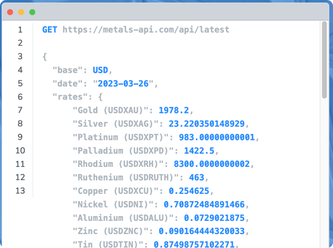
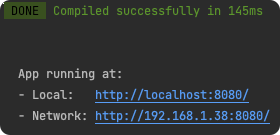
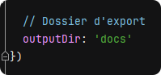

# Vue Cours des métaux précieux

Projet Simple d'affichage des cours des métaux précieux.

<!-- TOC -->
* [Vue Cours des métaux précieux](#vue-cours-des-métaux-précieux)
  * [Installation des dépencances](#installation-des-dépencances)
  * [Configuration](#configuration)
    * [Sous répertoire de l'application](#sous-répertoire-de-lapplication)
  * [Lancement en local](#lancement-en-local)
  * [Compilation pour distribution](#compilation-pour-distribution)
    * [Lints and fixes files](#lints-and-fixes-files)
    * [Customize configuration](#customize-configuration)
<!-- TOC -->

## Installation des dépencances
```bash
npm install
```

## Configuration

Copiez et renommez le fichier **.env.sample** en **.env.local** et saisissez y la clé API de *https://metalpriceapi.com*.

https://metalpriceapi.com
np

### Sous répertoire de l'application

Quand l'application sera déployée, elle pourra être dans un sous répertoire.
Il faut le configurer en amont dans le fichier *vue.config.js*


```js
const { defineConfig } = require('@vue/cli-service')
module.exports = defineConfig({
  transpileDependencies: true,

  // Pour définir le futur sous répertoire de l'application
  publicPath: process.env.NODE_ENV === 'production'
    ? '/bijoubijou/'
    : '/'
})

```

## Lancement en local

```bash
npm run serve
```


## Compilation pour distribution

```bash
npm run build
```

La compilation se fait normalmeent dans un dossier **dist**.

Mais, la configuration dans **vue.config.js** définit le output dans **docs**


### Lints and fixes files
```
npm run lint
```

### Customize configuration
See [Configuration Reference](https://cli.vuejs.org/config/).
