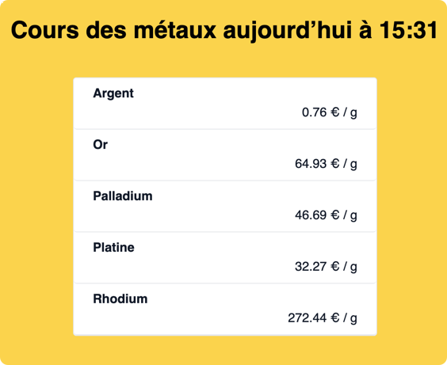
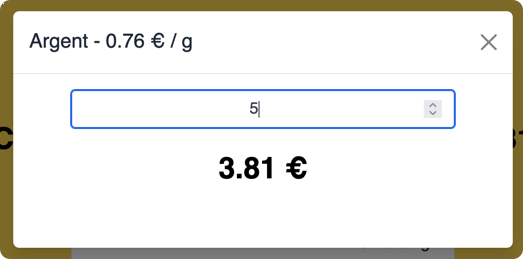

# Vue Cours des métaux précieux

Projet Simple d'affichage des cours des métaux précieux.




## Installation des dépencances
```bash
npm install
```

## Configuration

Copiez et renommez le fichier **.env** en **.env.local** et saisissez y la clé API de *metals-api.com*.

https://www.metals-api.com/


### Sous répertoire de l'application

Quand l'application sera déployée, elle pourra être dans un sous répertoire.
Il faut le configurer en amont dans le fichier *vue.config.js*

```js
const { defineConfig } = require('@vue/cli-service')
module.exports = defineConfig({
  transpileDependencies: true,

  // Pour définir le futur sous répertoire de l'application
  publicPath: process.env.NODE_ENV === 'production'
    ? '/bijoubijou/'
    : '/'
})

```

## Lancement en local
```bash
npm run serve
```


## Compilation pour distribution
```bash
npm run build
```

### Lints and fixes files
```
npm run lint
```

### Customize configuration
See [Configuration Reference](https://cli.vuejs.org/config/).
