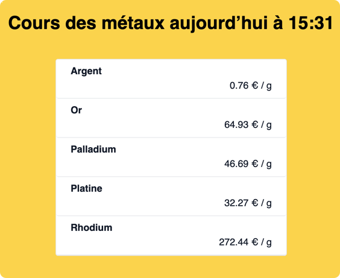
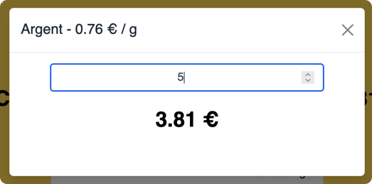
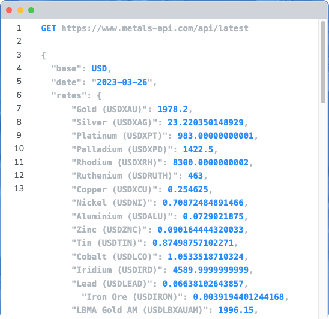
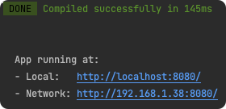

# Vue Cours des métaux précieux

Projet Simple d'affichage des cours des métaux précieux.




## Installation des dépencances
```bash
npm install
```

## Configuration

Copiez et renommez le fichier **.env** en **.env.local** et saisissez y la clé API de *metals-api.com*.

https://www.metals-api.com/



## Lancement en local
```bash
npm run serve
```


## Compilation pour distribution
```bash
npm run build
```

### Lints and fixes files
```
npm run lint
```

### Customize configuration
See [Configuration Reference](https://cli.vuejs.org/config/).
